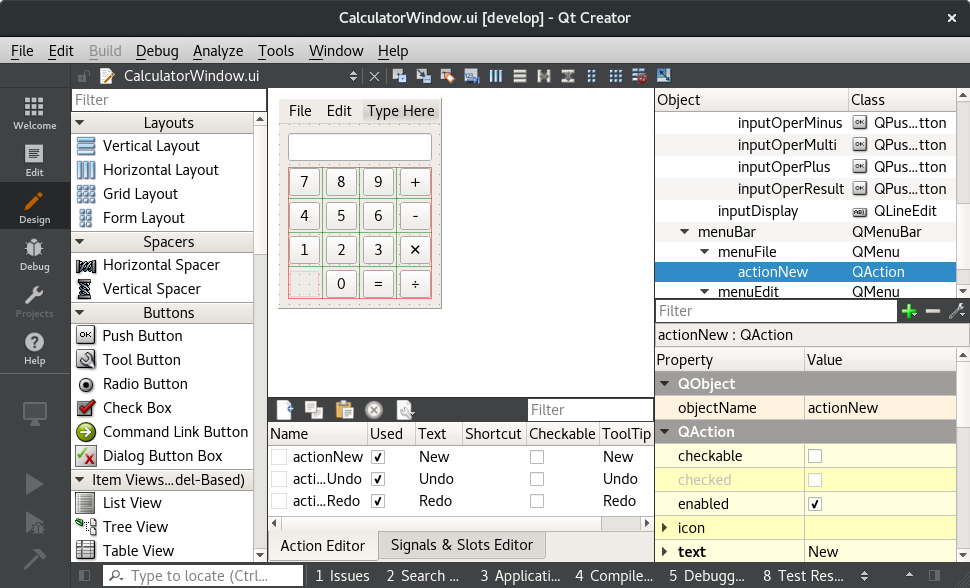
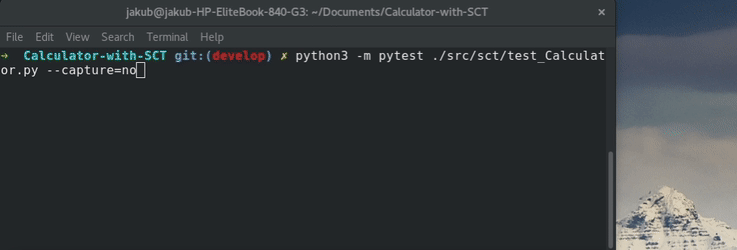

# ToDo list
- [x] Drag and drop QT5 GUI support
- [x] Comunication with SctServer via C++ REST SDK (Casablanca)
- [x] Mocked Calculator input
- [x] Basic python framework for SCT
- [ ] Docker container with application
- [x] Unit test framework for Calculator application
- [ ] Basic Calculator features (+, -, etc.)
- [ ] Advanced Calculator features (log, fib, power(n), etc.)
- [ ] Real SCT written in Python
- [ ] Continuous Integration

At the moment application is broken on purpose.

# Calculator-with-SCT
Educational project about writing SCT in python

### Broken application


# Development
1. Update your user.name and user.email for this project, do not use your company email.
2. Use your cmake tool to build the project. Remember to check SCT_SERVER checkbox if you want to use it.

## GUI
To edit GUI open CalculatorWindow.ui form in QTCreator or in QTDesigner



# SctServer communication

#### How to use SctServer
To use Calculator with SctServer you need to use cmake-gui with SCT_SERVER checkbox on.


#### Sending events to SctServer
Servers accepts data send with post method on given address. The adress of the SctServer at this moment is set to "http://localhost:34568/SctServer/Action/"

##### python example
```python
import http.client
import urllib
import time
import json

def sendFour():
  payload = "4" # sending 4 as an input will simulate pressing 4

  headers = {"Content-type": "application/x-www-form-urlencoded","Accept": "text/plain"}
  conn = http.client.HTTPConnection("localhost:34568")
  conn.request("POST", "/SctServer/Action", payload, headers)
  response = conn.getresponse()
  data = response.read()
  conn.close()
  time.sleep(0.1)
  return json.loads(data) # return json object
```
##### Running python tests


##### possible inputs
- 0-9 number pad buttons
- -, +, \*, / binary operators
- = result of a binary operation

#### Receiving output
Server sends output formated as a json.
```json
{
  "badServerInput": false,
  "input": "4",
  "screenState": "4",
  "unknownInput": false
}
```
- "badServerInput" flag is set true if server gets more then one character as a input.
- "input" shows the input that server got.
- "screenState" string shows what is displayed on the screen of the program.
- "unknownInput" flag is set true if server gets input which it can not interpret.
